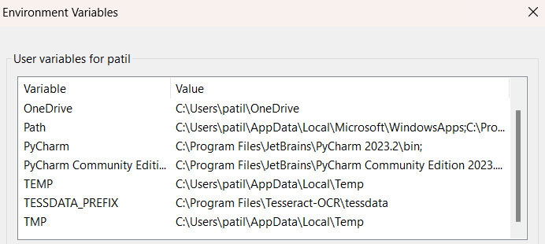
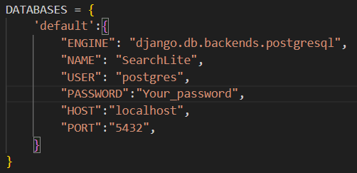
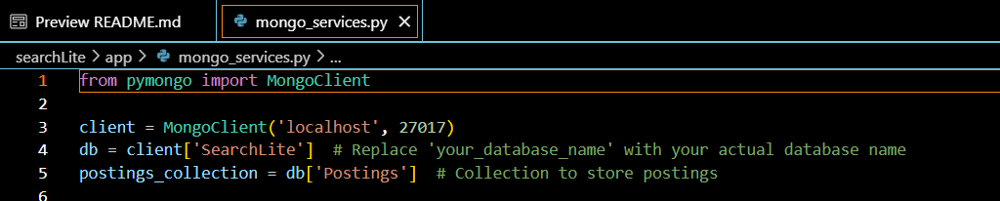
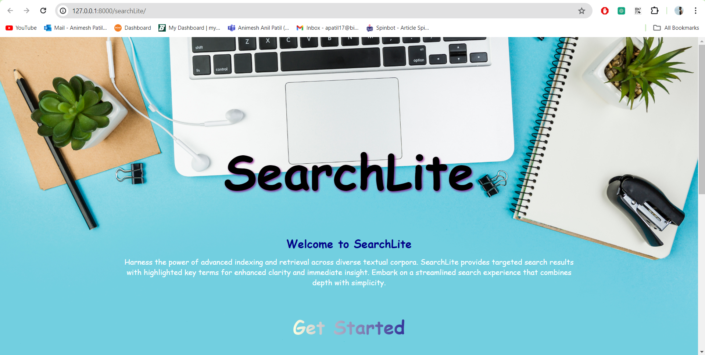
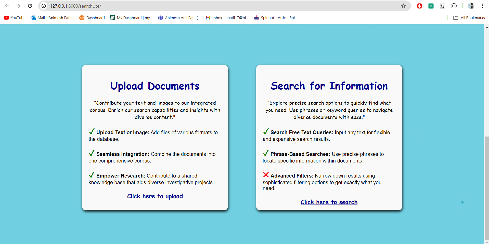
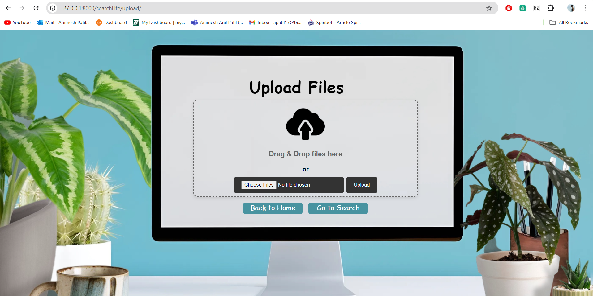
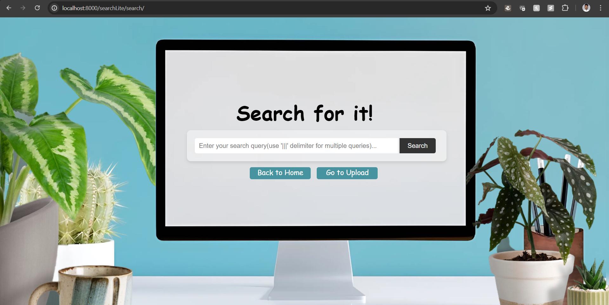
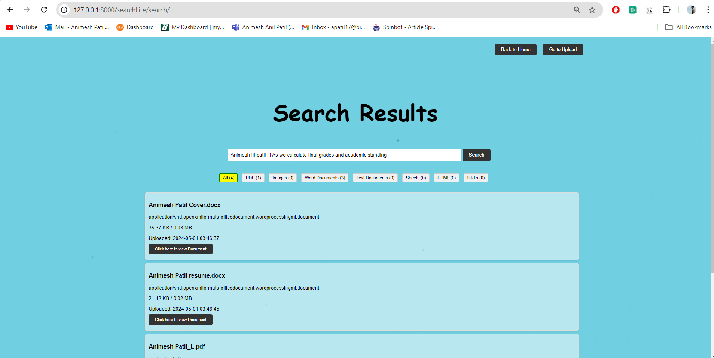
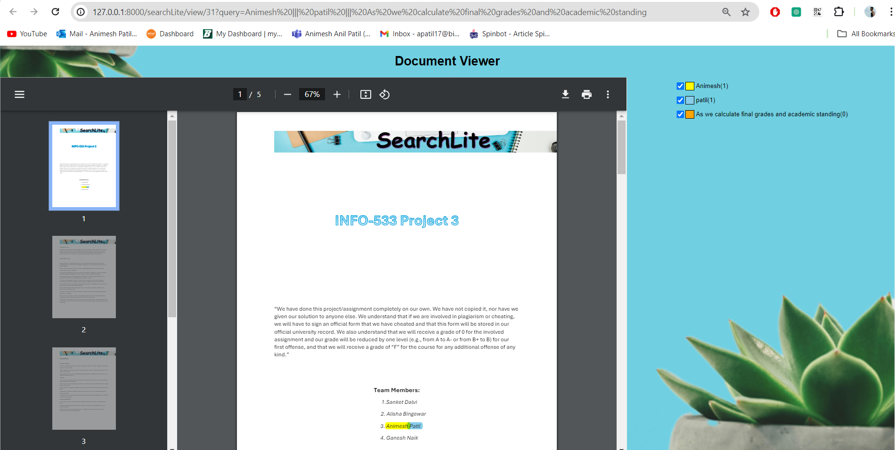

# SearchLite: A Lightweight Search Engine for Document Retrieval

SearchLite is a lightweight search engine designed to facilitate document retrieval based on free text queries, specifically tailored for researchers navigating the vast landscape of academic literature. This project aims to provide a simple yet effective solution for searching through research papers and articles using natural language queries.
With SearchLite, users can effortlessly upload multiple documents of supported file types, conduct searches across various queries, and filter the results to find relevant information quickly. The integrated document viewer allows users to highlight terms in PDF documents, making it easier to identify and read specific articles of interest. By streamlining the search process, SearchLite empowers researchers to efficiently gather and access the literature needed to support their studies, saving time and enhancing productivity.

## Features

Certainly! Here's the information in a formatted list:

- **Free Text Queries:** Users can enter natural language queries to search for relevant documents.
- **Document Indexing:** SearchLite indexes documents to enable efficient and quick retrieval of relevant content.
- **Responsive Interface:** The web-based interface allows users to interact with the search engine seamlessly across different devices.
- **Upload Multiple Documents:** Users can upload multiple documents of supported file types.
- **Can't Upload Same Documents:** Storing hash value of each file in postgres to restrict user from upload same documents again.
- **Search Multiple Queries:** Users can search multiple queries to find relevant documents.
- **Filter Search Results:** Users can filter search results based on specific criteria.
- **View Documents with Highlighted Terms:** Users can view documents with highlighted terms, particularly in PDF format.
- **Supports Various File Types:** SearchLite supports various file types, including PDF, DOCX, CSV, TXT, HTML, and images.

## Setup

1. Clone the repository:

   ```bash
   git clone https://github.com/sanket-dalvi/searchLite
   ```

2. Create two folders in the project root directory:

   - `corpus`: For storing uploaded documents.
   - `highlighted_pdfs`: For storing PDF documents with highlighted terms.

3. Install the required dependencies:

   Before installing dependecies, 
   
   1. Create a virtual environment
   
      ```bash
      virtualenv virtual_environment_name 
      ```
      'virtual_environment_name' is your virtual environment name.

   2. Activate virtual evironment

        For mac/ linux:
       
      ```bash
       source env/bin/activate 
      ```
         
        Windows:

      ```bash
       .\env\Scripts\activate
      ```

   3. Install dependencies

      ```bash
      pip install -r requirements.txt
      ```

4. Install Tesseract OCR:

- `Linux:`

   ```bash
   sudo apt-get install tesseract-ocr
   ```
- `macOS (using Homebrew):`

   ```bash
   brew install tesseract
   ```
- `Windows:`

- **Download and install Tesseract from the official GitHub repository: Tesseract OCR.**

- **Add the Tesseract installation directory to your system's PATH.**

- **Add Path Variable**


  

- **Edit path Variable**

  

- `Install PyTesseract:`

   ```bash
   pip install pytesseract
   ```
5. Create and Set you postgres database details.

- Create database **SearchLite** in postgres database

   

6. Create database **SearchLite** and Collection **Posting**.

   
   
   If you are running mongoDB server on different URL then update the details in mongo_services.py file as below
   

7. Run the Django development server:

   ```bash
   python manage.py runserver
   ```

8. Access the application at [http://127.0.0.1:8000/](http://127.0.0.1:8000/).


9. When exiting the server and closing the application

   deactivate your virtual environment using:

   ```bash
   deactivate
   ```

## Usage

1. **Homepage**: Access the homepage of the application.
  
  
2. **Upload**: Upload multiple documents of supported file types.
  
3. **Search**: Enter multiple queries to search for relevant documents.
  
4. **Results**: View search results and filter them based on specific criteria.
  
5. **Document Viewer**: View documents with highlighted terms in PDF format.
  


## Technologies Used

- **Python**
- **Django**
- **NLTK**
- **BeautifulSoup**
- **Pytesseract**
- **MongoDB** (for document storage and indexing)
- **Frontend**: HTML, CSS, JavaScript
- **Backend**: Python (Django framework)
- **Document Processing**: Tokenization, Positional Indexing
- **Search Algorithms**: Phrase-based retrieval, Inverted Indexing

## Contributors

- [Alisha Bingewar](https://github.com/abingewar)
- [Animesh Patil](https://github.com/apatil2332)
- [Sathya](https://github.com/Sathya0990)
